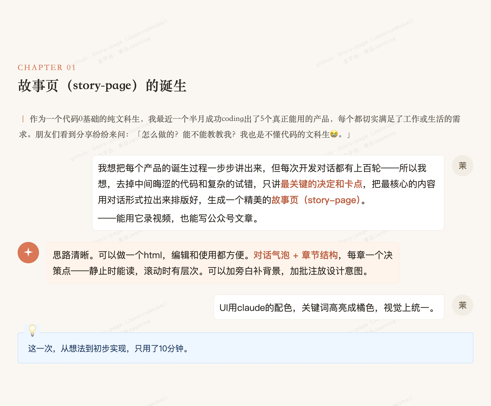

# story-page

> 🌍 [中文 README](README.md)

A [Claude Code](https://claude.com/claude-code) skill that turns your vibe-coding journey with Claude Code into a polished, **video-ready story page**.

Not a commit log, not a transcript dump — it pulls the **key decision moments** from your code and conversation history and renders them as a curated dialogue script.


<details>
<summary>📸 More previews</summary>




</details>

> Want to see the whole thing? Open `example.html` in any browser and scroll through.

---

## Who is this for

- You've vibe-coded a few small projects you're proud of and want to document them — but the original chat logs are too long to share
- You want a project intro page without writing long-form docs
- You want to make short videos or write articles about what you built, and need a page that **looks good and reads well even when frozen mid-scroll**

---

## Install

Drop the whole `story-page/` folder into your Claude Code skills directory:

```bash
mkdir -p ~/.claude/skills
cd ~/.claude/skills
git clone https://github.com/jasminemo1110/story-page.git
```

Claude Code will pick it up automatically.

---

## Usage

In any project directory, open Claude Code and type:

```
/story
```

Claude will:

1. Read `git log`, `README.md`, `CLAUDE.md`, and recent session transcripts
2. Extract 4–7 pivotal decision moments
3. Render them as dialogue bubbles into a single HTML file at `<project-root>/story.html`

### Add direction after the command — results get noticeably better

You can run `/story` alone, but **a sentence or two telling Claude what you want to highlight** makes the output much sharper. Common patterns:

```
/story focus on how the runway concept came together
/story emphasize that my parents are actually using this — skip technical details
/story only the second half, starting from when users came on board
/story skip what we've already covered, only the new progress this week
```

State the angle you want to highlight, what to skip, and who the audience is — Claude will pick chapters and tune the voice accordingly.

---

## Sequels: second, third, Nth time you run it

Once a project has a story page, running `/story` again **continues from where the last one ended** instead of rewriting from scratch:

- Filenames: `story.html` → `story-2.html` → `story-3.html`, never overwriting
- Title stays the same; cover gets a `Vol.2` badge
- Chapter numbers **continue across volumes** — Vol.1 ends at CHAPTER 07, Vol.2 starts at CHAPTER 08
- Subtitle and meta refresh based on the new content
- Topics already covered won't repeat — only fresh material gets in

Good for: staged releases, major versions, or treating your project as an ongoing series.

---

## Customize cover and signature

A few JSON fields control the cover and footer:

| Field | Controls | Example |
|---|---|---|
| `cover_tag` | Top capsule label on the cover | `"Me × Claude Code"` |
| `title` | Main title (wrap a word in `{accent: "..."}` to highlight it orange; use `{br}` to force a line break) | `"{accent: \"Zero-code\"} writer{br}5 products in one month"` |
| `subtitle` | Subtitle | One line that sets the tone |
| `meta` | Small text under the title | `"May 2026 · Skill · First open-source product"` |
| `created_by` | Personal byline in the footer | `"Jane Doe"` → renders as `Created by Jane Doe` |
| `closing` | Last footer line (with date, in the same language as the body) | `"Story stands as of May 5, 2026 · to be continued"` |

When generating, Claude will try `git config user.name` first, or just ask you.

You can edit any text by hand after generation — everything lives in the `<script id="story-data">` JSON block at the top of the HTML file. **No need to touch CSS or HTML structure.**

> **Editing JSON by hand?** When you want to quote a phrase, use typographic quotes like `「...」` or `“...”`, not plain double quotes `"` — the latter will break the JSON and your page will go blank.

---

## Can I use this without Claude Code?

Yes — **manual mode**:

The skill mechanism (`SKILL.md`) is Claude Code-specific, but `template.html` is plain HTML that anyone can use:

1. Copy `template.html` and rename it to `story.html`
2. Use any AI tool (Cursor, ChatGPT, Gemini, etc.) to fill **just the JSON block** based on your project — `cover_tag`, `title`, `chapters`, etc.
3. Replace the contents of `<script id="story-data">` with your generated JSON
4. Open in a browser

For `cover_tag`, write whatever fits your tool: `"Me × Cursor"` / `"Me × ChatGPT"` / anything you want.

---

## Language support

The skill **matches your project's primary language**. Detected from your README, source comments, and recent dialogue.

- Chinese project → Chinese story page
- English project → English story page
- Japanese / French / any other language → same idea

Default falls back to Chinese (since the skill was authored in a Chinese context). To force a different language, just say so: `/story write it in English`.

---

## File structure

```
story-page/
├── SKILL.md         # Instructions for Claude (generation rules, chapter selection, dialogue voice)
├── template.html    # The story page template — all styling lives here
├── example.html     # Real example: the author's journey from zero code to 5 products + this skill's birth
├── preview.png      # The hero image at the top of this README
├── README.md        # 中文文档
├── README.en.md     # English documentation
└── LICENSE          # MIT License
```

---

## Design choices

- **One decision per chapter** — not a feature list, not a commit log
- **Readable when paused, rhythmic when scrolled** — designed for short-video pause frames
- **The user is the source of ideas**, Claude responds — this role split is encoded in `SKILL.md`
- **Orange `#D97757`** is Claude's brand color — used for keyword highlights and chapter numbers
- **JSON and CSS are fully separated** — change fonts, spacing, colors in one place

---

## One-click screenshot export

There's an orange button **📸 导出截图** ("Export screenshots") in the top-right corner. Click it and the page is sliced into multiple PNGs and **bundled into a single ZIP**:

- `01-cover.png` — the cover
- `02-chapter-01.png` ... `0N-chapter-NN.png` — one per chapter (chapter title + narration + dialogue + note)
- The last chapter PNG **also includes the footer** (date + byline + permanent attribution watermark) as the story's send-off

Each PNG has a very faint diagonal watermark `Made with Story Page · by 茉白Jasmine` (5% opacity — practically invisible at normal viewing, only shows when zoomed in). It preserves attribution when content gets reshared without being intrusive.

**Save location**: Chrome / Edge open a native "Save as" dialog so you can choose the folder. Safari / Firefox use the browser's default download folder (or whatever your browser settings dictate).

Perfect for: short-video frame transitions per chapter, blog posts that interleave chapter screenshots with narration.

> Powered by [`html2canvas`](https://github.com/niklasvh/html2canvas) and [`JSZip`](https://github.com/Stuk/jszip) (loaded from CDN only when you click the button — zero impact on initial page load). Hidden in print view.

---

## About the footer

Each generated story page has three small lines at the bottom:

1. **Story stands as of MMM D · to be continued** — controlled by `closing`, stamped at generation time
2. **Created by ...** — your byline, controlled by `created_by`, can be empty
3. **Made with story-page · by 茉白Jasmine** — tool name + author, links back to this repo, **always shown**

Line 3 is a common convention in open-source tools (think Obsidian Publish, Notion-style footers) — so anyone who likes the look can find their way back to the source. The font is tiny and doesn't get in the way of reading.

---

## License

MIT — see [LICENSE](LICENSE).

Use it, modify it, share it. If you make a story page you're proud of, I'd love to see it.
